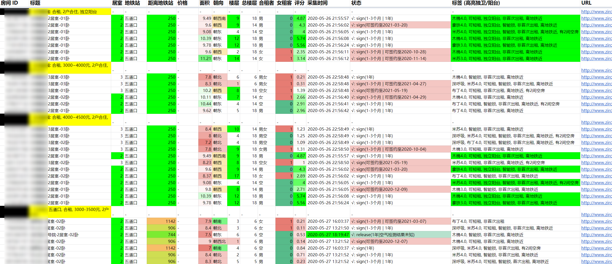

### 如有侵权, issue 留言

# zirooms

自如扫房打分脚本, 之前自用的, 一年内不维护, 估计也没什么人用的上
目前只在 windows python3 上用过, 没时间适配 py2

打分标准:
地铁近, 楼层高, 女生少, 价格低, 面积大, 房间少, 非顶楼, 朝向好

# 基本用法

0. pip3 install -r requirements.txt
1. 将需要采集的自如网站搜索结果的网址放入 list_urls.txt, 每行一条
2. 双击 `main.py`, 持续扫房, 间隔 5 分钟, 如果发现新房子, 在 windows 系统上会弹出来 explorer, 蜂鸣提醒
3. 双击 `copy_table.pyw` 复制到剪切板, 然后去模版 Google Sheets 对应位置粘贴即可 (第二行第一列)
4. 防止被封, 随手找了几个免费代理挂上

附赠 Google Sheets 过滤器模版一个 [Link](https://docs.google.com/spreadsheets/d/1dUvZKIwjKiEW71jarkD-dinfKgSkb6nBrKOVy4xDUkE/edit?usp=sharing) , 自己复制过去用

 
